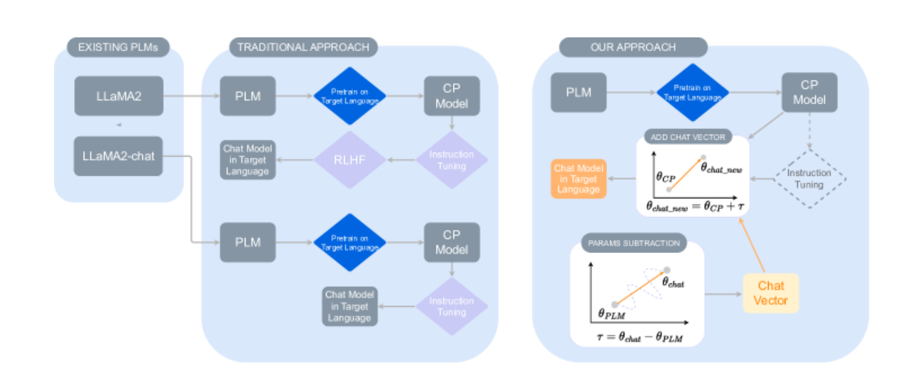
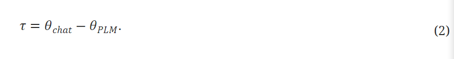
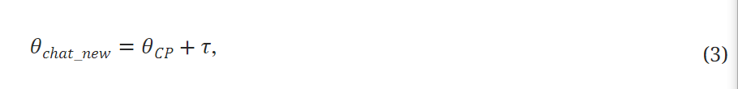
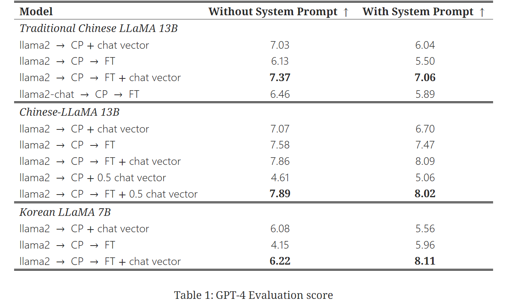
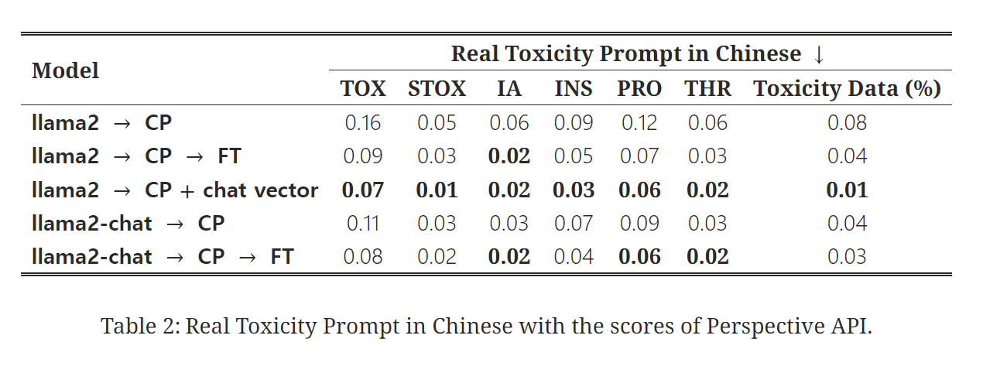
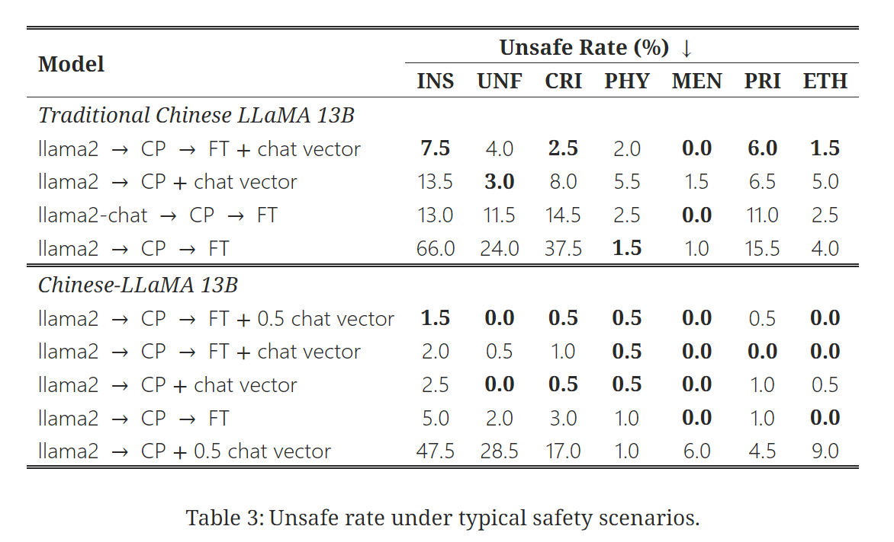

# Chat Vector: A Simple Approach to Equip LLMs With New Language Chat Capabilities

## 논문
https://arxiv.org/abs/2310.04799 

## 요약

target language에 대해 instruction을 학습시키고 싶을 때, 
chat vector를 통해 산술 연산을 수행하는 것이 대상언어로 rlhf를 재구현 하는 것보다 효율적이다.

## 논문 상세 내용

### 목차
[Abstract](#abstract) 
[3.2 Chat Vector](#32-chat-vector ) 
[5.1 Instruction Following Ability Evaluation](#51-instruction-following-ability-evaluation) 
[5.2 Assessing Toxicity Using Real Toxicity Prompts](#52-assessing-toxicity-using-real-toxicity-prompts) 
[5.3 Safety Prompts](#53-safety-prompts) 
[5.5 Limitation of Chat Vector](#55-limitation-of-chat-vector)

### Abstract
CP: 논문 내에서 target language에 대한 pre-train라는 의미로 사용됨.

llama2-chat 모델에 continual pre-training(CP)하는 것 보다는 
CP이후에 chat vector 수행한 것의 성능이 더 좋았다.

chat vector를 통합하기 이전에
fine-tuning을 적용하면
fine-tuning dataset의 규모나 사전학습된 모델의 언어에 관계없이 성능을 최적화 할 수 있음.

가장 중요한 것은,
chat vector를 통해 산술연산을 수행하는 것이 대상언어로 rlhf를 재구현하는 것보다 효율적이다.

toxicity, capability of following instruction, multi-turn dialogue로 평가

### 3.2 Chat Vector

instruction 학습된 chat 모델의 parameter에서 plm 모델의 parameter를 뺀 다음, 
target language로 cp된 모델의 parameter에 그 차이를 더한다.

효과:
>target language에 대해 instruction 능력을 얻어내는 것 뿐만 아니라, 유용성, 무해성 조정도 명시하고 있음.

### 5.1 Instruction Following Ability Evaluation

여러 case에 따른 evaluation score

#### evaluation을 통해 알 수 있었던 사항.
> (1) chat vector를 통해 모델이 instruction을 따르도록 할 수 있음. 
> (2) 여러 언어 기반 모델에 적용 가능. 
> (3) ft와 chat vector는 상호보완효과가 있음. 
> (4) base -> cp -> ft -> chat vector의 성능이 가장 높았다. 

### 5.2 Assessing Toxicity Using Real Toxicity Prompts

chat vector를 적용했을 때 toxicity가 가장 낮았다.

### 5.3 Safety Prompts

ft 까지 진행한 모델에 대해서 0.5 chat vector를 적용한 모델의 unsafte rate가 가장 낮았다. 
>※ cp 이후에 0.5 chat vector를 적용한 모델은 성능이 그리 좋지 못함. 
 논문에서는 chat vector의 최적 계수를 구하기 위한 추가적 연구가 필요하다고 언급. 

### 5.5 Limitation of Chat Vector

chat vector 적용하면 base model의 language 응답 나오는 빈도 증가. 
이것을 해결하기 위해 논문에서는 chat-vector에 0.5의 가중치를 곱함. 
0.5의 가중치를 곱하는 것은 target 언어의 생성확률을 높이지만, toxity는 증가 (Trade-off)

논문에서는 향후 이 문제에 대해 더 연구할 계획이라고 언급.
