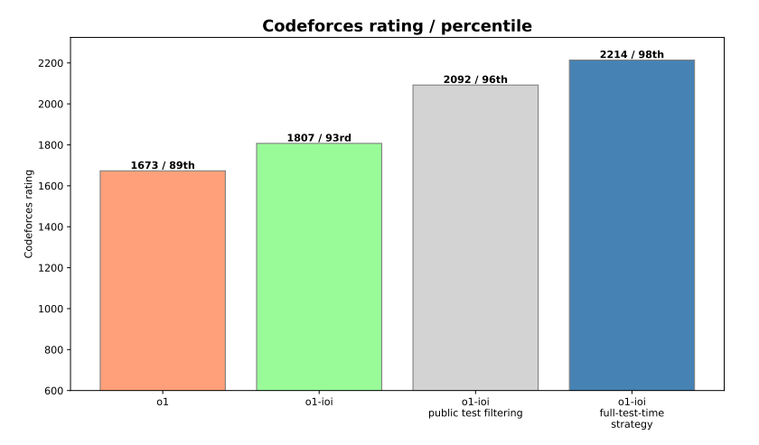
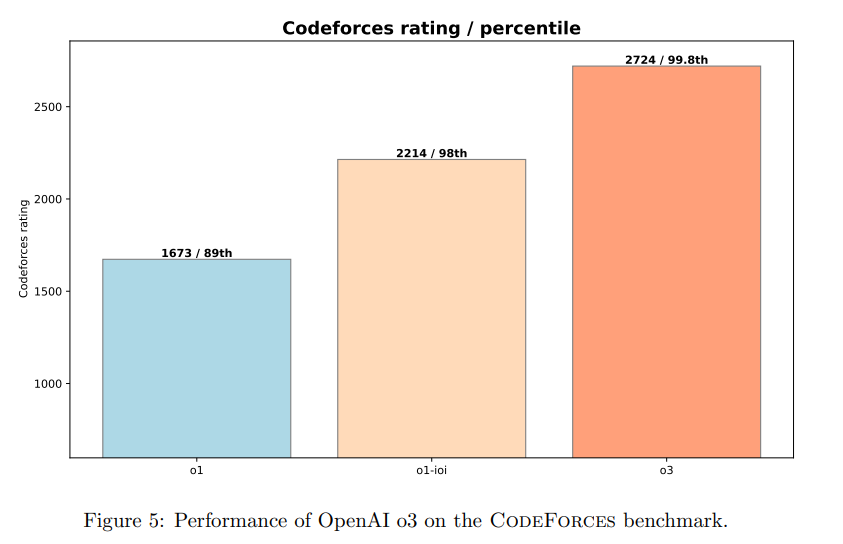
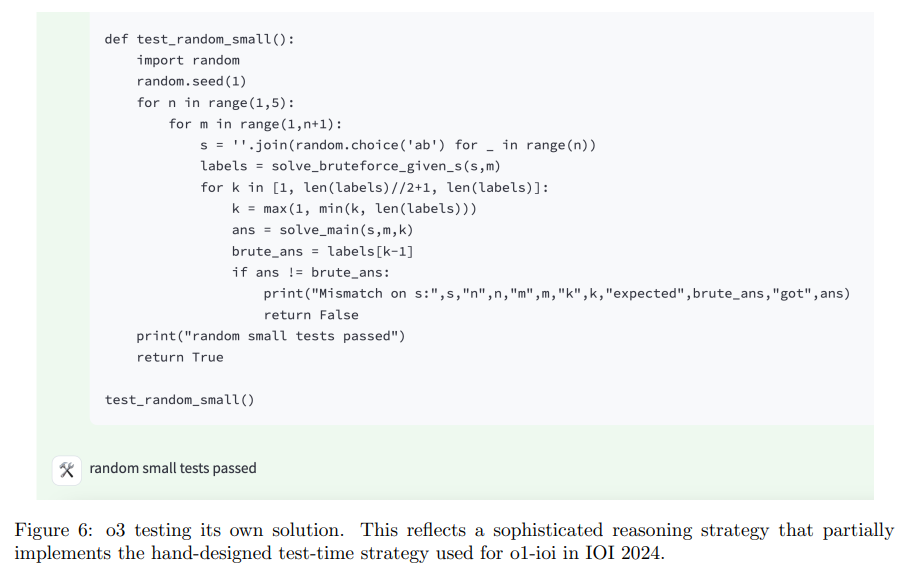
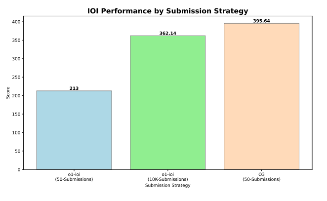
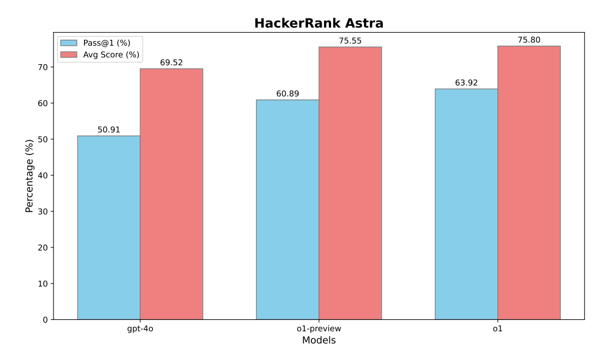
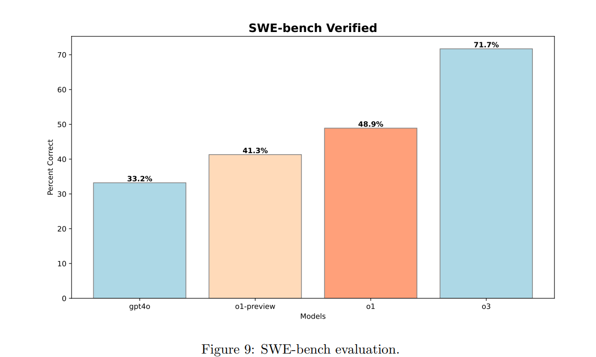
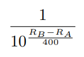
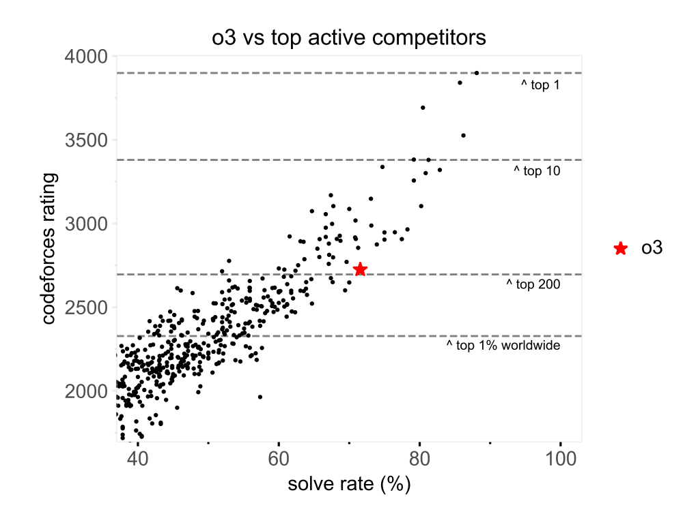

# Competitive Programming with Large Reasoning Models

## 논문 
https://arxiv.org/pdf/2502.06807<br>


## 요약
범용 추론 모델인 o1, o3, 그리고 2024 국제정보올림피아드(이하, IOI)를 위해 추론 전략을 추가한 o1-ioi의 성능을 비교합니다.

대회 참여 결과:<br>
o1-ioi(대화 실시간 참여): 49번째 백분위수<br>
o1-ioi(경쟁 제약 완화 시): 금메달<br>
o3(no 전략, no 제약 완화): 금메달<br>
특히, o3는 CodeForces에서 엘리트 인간 경쟁자와 맞먹는 등급을 기록합니다.

이 결과는 도메인 특화 기법에 의존하기보다 범용 강화학습을 확장하는 것이 경쟁 프로그래밍과 같은 추론 분야에서 최첨단 AI로 나아가는 견고한 길임을 시사합니다.


## 논문 상세 내용
### 목차

[3. Openai o1-ioi](#3-openai-o1-ioi)<br>
- [3.1 Coding RL fine-tuning](#31-coding-rl-fine-tuning)<br>
- [3.2 o1-ioi test-time strategy](#32-o1-ioi-test-time-strategy)<br>
- [3.3 CodeForces Benchmark](#33-codeforces-benckmark)<br>
- [3.4 IOI 2024 Live Competition](#34-ioi-2024-live-competition)<br>

[4. OpenAI o3](#4-openai-o3)<br>
- [4.1 CodeForces Benchmark](#41-codeforces-benchmark)<br>
- [4.2 IOI 2024 Benchmark](#42-ioi-2024-benchmark)<br>

[5. Software Engineering Evaluations](#5-software-engineering-evaluations)<br>
- [5.1 HackerRank Astra](#51-hackerank-astra)<br>
- [5.2 SWE-Bench Verified](#52-swe-bench-verified)<br>

[6. Conclusion](#6-conclusion)<br>

[Appendix B. Additional CodeForces Details](#appendix-b-additional-codeforces-details)<br>
- [B.1 Data](#b1-data)<br>
- [B.2 Grading](#b2-grading)<br>
- [B.3 Thinking Time](#b3-thinking-time)<br>
- [B.4 Estimated Rating](#b4-estimated-rating)<br>
- [B.5 Percentile Performance](#b5-percentile-performance)<br>

### 3. Openai o1-ioi
강화학습 시 연산량, 테스트 시 추론 연산량 둘 다 늘릴 수록 모델 성능이 지속적으로 향상된다는 사실을 발견


### 3.1 Coding RL fine-tuning
O1-ioi 학습 방식
프로그래밍 문제에 추가적인 훈련 계산 자원을 투입함으로써, 모델이 보다 복잡한 솔루션을 계획, 구현 및 디버깅하는 능력을 강화했습니다.
1. OpenAI o1 체크포인트에서 강화학습(RL) 훈련을 재개
2. 특히 어려운 프로그래밍 문제에 중점을 두어, 모델이 C++ 코드 생성과 런타임 체크 기능을 향상
3. 모델이 IOI 제출 형식으로 출력을 생성하도록 유도

이와 같이 코딩에 집중한 덕분에 o1-ioi는 추론 과정 중에 C++ 프로그램을 작성하고 실행할 수 있게 되었습니다.
모델은 해결책을 반복적으로 실행하고 개선함으로써 추론 능력을 향상, 그 결과 코딩과 문제 해결 능력이 모두 강화되었습니다.

### 3.2 o1-ioi test-time strategy
전체적으로, 우리는 각 IOI 문제를 구성 요소인 하위 작업들로 나누고, 각 하위 작업마다 o1-ioi로부터 10,000개의 솔루션을 샘플링한 후, 클러스터링 및 재정렬 기반 접근법을 활용하여 이 중 제출할 솔루션을 결정했습니다.

**Problem formulation**<br>
Subtask로 각 subtask에서 최고점을 부여한 것들을 종합.
각 subtask를 수행할 때 다른 subtask에 대한 정보는 제거하는 방식.<br><br>
**clustering**<br>
생성된 솔루션들을 모델이 생성한 256개의 테스트 입력에 대한 출력 결과를 기준으로 클러스터링.
모든 테스트 입력에 대해 서로 동일한 출력을 내는 프로그램들을 동일한 클러스터에 배치.<br><br>
**Reranking**<br>
생성된 솔루션들에 대해 아래 요소를 고려하여 재정렬 진행
- 학습된 평가 함수를 통해 솔루션의 품질 평가
- 모델이 생성한 test 입력에 대한 오류
- 제공된 공개 test caes를 실패한 경우

각 클러스터 별로 점수가 매겨짐
- 클러스터 내부의 샘플들의 제출 횟수에 따라 마이너스 패널티가 부과됨
- 마이너스 패널티에 대한 가중치를 선정하는 작업
    - 이전 ioi 문제들에 대해 위의 3가지 작업을 거치고 패널티 가중치를 random search 한 이후, 각 설정마다 제출 시뮬레이션을 수행
    - 시뮬레이션 결과가 좋은 패널티 가중치를 선정

**submission**<br>
난이도가 가장 높은 하위 작업 부터 제출 시작.
각 하위 작업에 대해 최고 순위를 기록한 솔루션을 선택.
해결된 하위 작업을 포함하는 상위 집합의 하위 작업 솔루션을 제출할 때에는 
이미 해결된 하위 작업에 대한 테스트 입력에서 출력이 일치하지 않는 솔루션을 걸러냄
- 실패할 것이 확실한 솔루션을 빠르게 배제하는 효과<br>

구체적 예시:
>
    예를 들어, Subtask A의 테스트 입력이 [1, 2, 3]일 때 올바른 출력이 6이라고 합시다.
    Subtask B는 추가 조건이 있지만, 기본적으로 Subtask A의 조건을 포함합니다.
    따라서 Subtask B에 제출하기 전에, 후보 솔루션이 [1, 2, 3] 입력에 대해 6을 출력하지 않는다면, 그 솔루션은 Subtask A의 조건을 만족하지 않는 것으로 간주되어 즉시 배제됩니다.

### 3.3 CodeForces Benchmark
Codeforces Benchmark에 대해 o1을 기반으로 도메인 특화 강화학습 파인튜닝과 고급 선택 휴리스틱(3.2에 연급된 전략)등을 토대로 성능이 크게 개선되었음을 강조



### 3.4 IOI 2024 Live Competition
국제 정보올림피아드에 인간 참가자와 동일한 조건으로 참가<br>
6개의 알고리즘 문제 해결을 위해 10시간, 문제당 50회 제출 허용<br>
참가자 중 49번째 백분위에 해당하는 성적<br>
비교를 위해, 50개의 임의 제출을 선택했을 때 **156**점, 제출 전략을 적용했을 때 **213**점(약 60점 상승)

제출 제한을 문제당 10000회로 완하하자 모델 성능이 극적으로 향상.<br>
Selection-strategy를 사용하지 않은 상태에서 362.14점 (금메달 기준 초과)<br>
해당 점수를 산출한 샘플은 부록 C에 제시되어 있음.<br>


### 4. OpenAI o3
o1과 o1-1o1에서 얻은 인사이트를 바탕으로, human-engineered test-tiem strategies에 의존하지 않고 오직 **강화학습**을 통해서 그 한계를 탐구하고자 함




### 4.1 CodeForces Benchmark

Fhurther RL을 통해 경쟁적 프로그래밍에 상당한 도약을 이루어냄.<br>
o3에서 더욱 통찰력 있고 신중한 COT를 관찰함.<br>
Figure6에서 o3에 의해 발견된 고도의 test-time strategy를 보여주고 있음.<br>



- 검증이 간단하지 않은 문제의 경우, 종종 브루트 포스(무차별 대입) 솔루션을 작성함
- 이후에 보다 최적화된 알고리즘의 출력과의 비교 과정을 거침

### 4.2 IOI 2024 Benchmark
o1-ioi 모델을 통해 진행한 ioi 2024 benckmark를 o3 모델에 대해서도 진행.

**sampling approach**<br>

Oi-ioi를 평가할 땐 sub-task 별로 솔루션을 따로 샘플링 했지만, o3는 원래 문제 명세를 포함한 단일 프롬프트에서 솔루션을 샘플링함.<br>
O1-ioi가 subtask 당 1만개의 솔루션을 내는 것에 반해, o3는 문제당 천개의 솔루션만을 추출함.

해법을 선택하는 전략에도 차이가 있었다.<br>
O1-ioi가 복잡한 human-defined test-time strategy(3.2)를 사용.<br>
O3는 훨씬 단순한 방식을 사용<br>
- 1024개의 샘플 중 가장 연산량이 높은 상위 50개의 솔루션을 선택<br>

```
단순히 highest compute를 기록한 솔루션을 채택하는 것이 어떻게 전략이 될 수 있는건지?

본 논문 3. Openai o1-ioi 에서 test-time compute 증가 --> accuracy 증가 언급

- Cot가 길어져 충분히 사고 과정을 전개했거나
- 추가 검증과정(간단한 브루트포스 솔루션과의 비교, 여러 입력 케이스 기반 테스트)

위와 같은 이유를 가지지 않을까...
```


**Results**<br>
O3는 도메인 특화 heuristic이나 클러스터링 기반 방법에 의존하지 않고도 o1-ioi를 능가합니다.


### 5. Software engineering evaluations
깊은 논리적 사고가 필요한 복잡한 알고리즘 문제를 푸는데 있어서,
추론이 대형 언어모델의 성능을 크게 향상시킨다는 것을 입증했다.<br>
실제 코딩 작업에 대해 아래의 데이터셋을 통해 추론의 영향을 평가하고자 했다.
- Hackerank astra 데이터셋
- SWE-bench verified

### 5.1 HackerRank Astra
현업 개발 작업을 모방한 65개의 프로젝트 중심 코딩 챌린지.<br>
공개 TC를 제공하지 않음.



기존 4o 대비, o1의 향상된 추론력과 적응력을 보여줌.

### 5.2 SWE-Bench Verified
Openai의 human-validated를 거친 swe-bench의 하위 집합.<br>
500개의 검증된 작업 집합은
- 올바른 솔루션에 대해 잘못된 채첨을 하는 이슈
- 문제 설명이 불충분한 이슈
- 지나치게 구체적인 unit test 이슈

와 같은 일부 swe-bench의 이슈들을 수정함.



### 6. Conclusion
o-시리즈 대형 추론 모델을 통해, 우리는 CoT가 CodeForces와 IOI와 같은 경쟁 프로그래밍 벤치마크부터 SWE-bench와 Astra와 같은 복잡한 소프트웨어 엔지니어링 과제에 이르기까지 코딩 작업의 성능 향상을 위한 강력한 전략임을 입증합니다.<br>

우리의 연구 결과는 강화학습 연산 자원을 늘리고, 이에 더해 테스트 시 연산 자원을 강화하면 모델의 성능이 꾸준히 향상되어 세계 최고의 인간 수준에 근접할 수 있음을 강조합니다.

### Appendix B. Additional CodeForces Details
인간과 모델의 성능을 비교하기 위해 시뮬레이션을 수행함.<br>
이 섹션에서는
- 시뮬레이션이 어떻게 수행되었는지
- 전체 점수와 등급이 어떻게 계산되었는지
- 각 대회별 결과

에 대해 자세히 설명함

### B.1 Data
Test data와 Train data는 엄격히 분리되었다는 취지의 내용.

### B.2 Grading
모델이 전체 테스트 셋에 대해 10회의 독립적인 제출을 하여, 이 중 하나라도 통과하면 문제를 해결한 것으로 간주<br>
※ 실제 인간 참가자들은 전체 테스트 셋과 높은 상관관계를 가지는 일부 범위의 사전 테스트 케이스만 제공 받음.

### B.3 Thinking Time
인간 참가자들은 솔루션을 빠르게 제출할수록 더 높은 점수를 받음.<br>
모델은 병렬적 사고를 통해 모든 문제에 대해 동시에 도전할 수 있는 이점을 가지고 있음.<br>
모델만이 가지는 이 이점을 줄이기 위해, 주요 결과에서 각 문제를 해결한 o3의 점수를 다음과 같이 산정.<br>

```
방법 1. 해당 문제를 해결한 인간 참가자들 중 동일한 실패횟수를 가진 참가자들의 점수 중앙값으로 추정함.

위 방법을 대신해 모델의 실제 사고 추론에 걸리는 시간을 사용해서 등급을 계산할 수도 있다.

방법 2. 위 task에 대해 o3는 CoT 이외에도 답변에 순위를 매기기 위해 학습된 평가함수를 사용함.

이 과정은 완벽하게 병렬적으로 이루어지며, 실제 모델 제출 시간은 대회 중 사용 가능한 GPU 수에 따라 달라진다.

--> 매우 큰 클러스터 에서는 상위 순위 솔루션을 선택하는 데 걸리는 시간이 각 후보 제출에 대한 사고 시간의 최대값(약간 더 많은 시간) 과 거의 동일하다.

즉, GPU 리소스가 풍부하다는 가정하에 방법 1보다, 방법 2를 통해 계산한 등급이 더 높게 산출 될 것이다.

초기 언어 모델 이후 순차적인 테스트 시 계산량이 급격히 증가했기 때문에, 모델들이 인간보다 문제를 빠르게 해결할 것이라는 보장이 없었지만, 실제로 o3는 빠르게 해결한다는 점을 주목합니다.
```
요약하자면, <br>
병렬 GPU가 풍부하다면 인간 참가자를 참고해서 점수를 매기는 방법 보다는<br>
추론 시간, CoT, 평가 함수를 사용한 방법으로 매긴 점수가 높을 것이다.

### B.4 Estimated Rating
rating은 elo 시스템과 유사하며 참가자 B의 레이팅이 A보다 높을수록, B가 A를 이길 확률이 높아짐.



인간 참가자들의 레이팅과의 likelihood를 최대화 하여 모델의 레이팅 산출.

### B.5 Percentile Performance
Codeforce의 미공개 테스트 대회 12회 중 최소 8회 이상 참여한 실제 참가자와의 레이팅 비교.<br>
o3는 전세계 top 200 정도의 수준을 보임.

