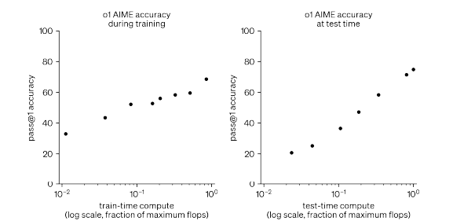

# Competitive Programming with Large Reasoning Models

## 논문 
https://arxiv.org/pdf/2502.06807 

## 요약
범용 추론 모델인 o1, o3, 그리고 2024 국제정보올림피아드(이하, IOI)를 위해 추론 전략을 추가한 o1-ioi의 성능을 비교합니다.

대회 참여 결과:
o1-ioi(대화 실시간 참여): 49번째 백분위수
o1-ioi(경쟁 제약 완화 시): 금메달
o3(no 전략, no 제약 완화): 금메달
특히, o3는 CodeForces에서 엘리트 인간 경쟁자와 맞먹는 등급을 기록합니다.

이 결과는 도메인 특화 기법에 의존하기보다 범용 강화학습을 확장하는 것이 경쟁 프로그래밍과 같은 추론 분야에서 최첨단 AI로 나아가는 견고한 길임을 시사합니다.

## 논문 상세 내용

### 목차
[3. Openai o1-ioi](#3) 
[3.1 Coding RL fine-tuning](#3.1) 

### 3. Openai o1-ioi
강화학습 시 연산량, 테스트 시 추론 연산량 둘 다 늘릴 수록 모델 성능이 지속적으로 향상된다는 사실을 발견

### 3.1 Coding RL fine-tuning
O1-ioi 학습 방식
프로그래밍 문제에 추가적인 훈련 계산 자원을 투입함으로써, 모델이 보다 복잡한 솔루션을 계획, 구현 및 디버깅하는 능력을 강화했습니다.
    1. OpenAI o1 체크포인트에서 강화학습(RL) 훈련을 재개
    2. 특히 어려운 프로그래밍 문제에 중점을 두어, 모델이 C++ 코드 생성과 런타임 체크 기능을 향상
    3. 모델이 IOI 제출 형식으로 출력을 생성하도록 유도

이와 같이 코딩에 집중한 덕분에 o1-ioi는 추론 과정 중에 C++ 프로그램을 작성하고 실행할 수 있게 되었습니다.
모델은 해결책을 반복적으로 실행하고 개선함으로써 추론 능력을 향상, 그 결과 코딩과 문제 해결 능력이 모두 강화되었습니다.

### 3.2 o1-ioi test-time strategy
전체적으로, 우리는 각 IOI 문제를 구성 요소인 하위 작업들로 나누고, 각 하위 작업마다 o1-ioi로부터 10,000개의 솔루션을 샘플링한 후, 클러스터링 및 재정렬 기반 접근법을 활용하여 이 중 제출할 솔루션을 결정했습니다.

**Problem formulation** 
Subtask로 각 subtask에서 최고점을 부여한 것들을 종합.
각 subtask를 수행할 때 다른 subtask에 대한 정보는 제거하는 방식.  
**clustering** 
생성된 솔루션들을 모델이 생성한 256개의 테스트 입력에 대한 출력 결과를 기준으로 클러스터링.
모든 테스트 입력에 대해 서로 동일한 출력을 내는 프로그램들을 동일한 클러스터에 배치.  
**Reranking** 
생성된 솔루션들에 대해 아래 요소를 고려하여 재정렬 진행
- 학습된 평가 함수를 통해 솔루션의 품질 평가
- 모델이 생성한 test 입력에 대한 오류
- 제공된 공개 test caes를 실패한 경우

각 클러스터 별로 점수가 매겨짐
- 클러스터 내부의 샘플들의 제출 횟수에 따라 마이너스 패널티가 부과됨
- 마이너스 패널티에 대한 가중치를 선정하는 작업
    - 이전 ioi 문제들에 대해 위의 3가지 작업을 거치고 패널티 가중치를 random search 한 이후, 각 설정마다 제출 시뮬레이션을 수행
    - 시뮬레이션 결과가 좋은 패널티 가중치를 선정

**submission** 
난이도가 가장 높은 하위 작업 부터 제출 시작.
각 하위 작업에 대해 최고 순위를 기록한 솔루션을 선택.
해결된 하위 작업을 포함하는 상위 집합의 하위 작업 솔루션을 제출할 때에는 
이미 해결된 하위 작업에 대한 테스트 입력에서 출력이 일치하지 않는 솔루션을 걸러냄
- 실패할 것이 확실한 솔루션을 빠르게 배제하는 효과 

구체적 예시:
>
    예를 들어, Subtask A의 테스트 입력이 [1, 2, 3]일 때 올바른 출력이 6이라고 합시다.
    Subtask B는 추가 조건이 있지만, 기본적으로 Subtask A의 조건을 포함합니다.
    따라서 Subtask B에 제출하기 전에, 후보 솔루션이 [1, 2, 3] 입력에 대해 6을 출력하지 않는다면, 그 솔루션은 Subtask A의 조건을 만족하지 않는 것으로 간주되어 즉시 배제됩니다.
