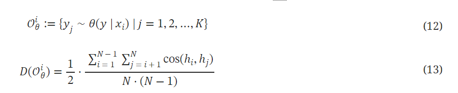

# ORPO: Monolithic Preference Optimization without Reference Model

## 논문 
https://arxiv.org/pdf/2403.07691 

## 요약

모델의 선호도 정렬 알고리즘에는 다양한 방법들이 있지만, ORPO 에서는 reference 모델없이 한 번의 학습만으로 chosen 답변을 따라가고, reject 답변과 멀어지는 학습 방법에 대해 설명한다.

OPRO는 reference 모델이 필요 없다는 점, forward pass가 기존의 DPO, RLHF에 비해 절반으로 줄어든다는 점(4-->2)으로 메모리 할당, 연산 과정에서 이점이 있다.

## 논문 상세 내용

### 목차
[3 The Role of Supervised Fine-Tuning](#3-the-role-of-supervised-fine-tuning) 
[4 Odds Ratio Preference Optimization](#4-odds-ratio-preference-optimization) 
[4.3 gradient of ORPO](#43-gradient-of-orpo) 
[5.1 Training config](#51-training-config) 
[5.2 Leaderboard evaluation](#52-leaderboard-evaluation) 
[6.1 Single-turn instruction following](#61-single-turn-instruction-following) 
[6.3 Reward model win rate](#63-reward-model-win-rate) 
[6.4 lexical diversity](#64-lexical-diversity) 
[7.1 comparison to probability ratio](#71-comparison-to-probability-ratio) 
[7.2 Minimizing ℒ 𝑂𝑅](#72-minimizing-ℒ-𝑂𝑅) 
[7.3 Computational Efficiency](#73-computational-efficiency) 
[Appendix E Ablation on the Weighting Value (𝜆)](#appendix-e-ablation-on-the-weighting-value-𝜆) 
[Appendix H Special Instructions for Verbosity Assessment](#appendix-h-special-instructions-for-verbosity-assessment) 

### 3. The Role of Supervised Fine-Tuning

cross entropy loss는 정답(chosen)과 비교해서 logit이 낮으면 penalty를 주지만,
원하지 않는 답변에 대해 직접적인 penalty를 주진 않음.

그로인해 chosen을 가지고 학습을 시키더라도 reject에 대한 log prob 또한 증가함.

- - -

### 4. Odds Ratio Preference Optimization
선호 답변과 비선호 답변을 구별하기 위해 음의 로그 우도 손실(Negative log-likelihood loss)에 기반한 새로운 선호도 정렬 알고리즘 ORPO

odds ratio는 x 다음에 y가 나올 확률이 그렇지 않을 확률의 몇 배 인지를 의미.  

**굳이 odds ratio를 사용한 이유는 7에서 설명**

직관적으로, 모델이 x를 입력받았을 때, 나와야 하는 답변의 확률이 그렇지 않은 답변의 확률의 몇 배인지를 계산.

L_SFT - 전통적인 손실 함수 
선호 답변을 따라가도록 유도하는 손실함수    

L_OR - odds ratio를 기반으로 한 손실 함수 
chosen과 reject 사이의 차이를 크게 하는 것이 목적인 손실함수  
*음의 로그, 시그모이드를 적용해 L_or을 최소화 하는 방식으로 학습*

#### 4.3 Gradient of ORPO

L_OR의 gradient는 delta, h 로 구분지을 수 있음.

delta: 잘못된 예측에 대한 패널티
>선호되는 응답의 확률이 거부된 응답의 확률보다 상대적으로 높을 때,  
식 9에서 델타 --> 0으로 수렴  
반대 상황에서, 모델이 거부된 응답을 생성할 가능성이 더 높을 경우 매개변수 업데이트를 가속화하는 패널티 항으로 작용한다는 것을 의미

h: 선호되는 응답과 거부된 응답 그래디언트 사이의 대조

눈문 원문 내용  
Specifically, 
1
−
𝑃
​
(
𝑦
|
𝑥
)
 in the denominators amplifies the gradients when the corresponding side of the likelihood 
𝑃
​
(
𝑦
|
𝑥
)
 is low. For the chosen responses, this accelerates the model’s adaptation toward the distribution of chosen responses as the likelihood increases.

> 구체적으로, 분모의 (1 - P(y|x))는 해당 확률 (P(y|x))이 낮을 때 그래디언트를 증폭시킴.  이러한 점이 선호되는 응답의 확률이 증가함에 따라, 더욱 더 선호되는 응답의 분포로의 적응을 가속화하는 방향으로 진행됨.

이 부분을 처음 이해할 때,

**1. 분모의 1-P(y|x) 값은 likelihood P(y|x) 값이 작으면 작을수록 gradient를 증폭시킨다.**

1번과 같이 해석 해봤는데 실제 수식 값과도 맞지 않는 것 같고 다음 문장과 상충되는 것 같아서,

**2.  likelihood P(y|x) 값이 수치적으로 작은 값일 때, 이를 보완하기 위해 1-P(y|x) 가 gradient를 증폭시키는 용도로 사용된다.**

일단은 2번과 같이 이해하고 문의 메일을 보내놓은 상태.

### 5.1 Training config
Y_w=y_l 이거나 y_w, y_l 둘 중 하나가 없는 데이터는 필터링으로 제거.

### 5.2 Leaderboard evaluation
모델 성능 평가를 위해 AlpacaEval1.0, AlpacaEval2.0, MT-Bench 등을 사용. 

평가자로서의 GPT-4 (Achiam et al., 2023): 
> AlpacaEval 1.0: GPT-4를 사용해 훈련된 모델이 text-davinci-003에서 생성된 응답보다 더 선호되는지 평가

> AlpacaEval 2.0: GPT-4-turbo를 평가자로 사용하여, 훈련된 모델이 GPT-4에서 생성된 응답보다 더 선호되는지 평가

> MT-Bench: GPT-4를 사용하여 모델이 멀티턴 대화에서 지시에 따른 답변을 얼마나 잘 따르는지 평가

### 6.1 Single-turn instruction following

### 6.3 Reward model win rate
Sft, +dpo, +ppo 모델에 비해
Orpo 모델의 win rate가 높지만, 파라미터가 적은 모델에 대해선 +dpo가 이기는 case도 있음.

### 6.4 lexical diversity 

𝒪𝜃𝑖는 모델 𝜃가 입력 𝑥𝑖에 대해 생성한 K개의 응답 𝑦𝑗의 집합을 나타냄.  
여기서 𝑗는 1부터 K까지의 인덱스.

𝐷(𝒪𝜃𝑖)는 생성된 응답들 사이의 다양성을 측정하는 지표로, 입력 𝑖에 대해 생성된 응답들의 집합 𝒪𝜃𝑖 내의 모든 응답 쌍 (ℎ𝑖, ℎ𝑗) 사이의 코사인 유사도의 평균을 1에서 빼서 계산. 
이때, ℎ𝑖와 ℎ𝑗는 각 응답의 Gemini-Pro 임베딩을 나타냅니다. (Gemini Team et al., 2023)에서 사용한 방식인듯.

즉, 이 식은 입력에 대한 모델의 응답들 사이의 평균적인 다양성을 측정.
여기서 코사인 유사도는 두 벡터 방향의 유사도를 측정하며, 이 값이 1에 가까울수록 두 벡터가 유사하다는 것을 의미.

따라서, 𝐷(𝒪𝜃𝑖)값이 높을수록 응답들 사이의 다양성이 더 크다는 것.

이러한 방식으로 언어 모델의 선호도 정렬에 따른 어휘 다양성을 정량적으로 평가할 수 있으며, 이는 언어 모델이 다양한 응답을 생성할 수 있는 능력을 이해하는 데 중요.

>**per input diversity (단일 입력에 대한 다양성)** 
>각 입력에 대해 생성된 샘플들 간의 평균 코사인 유사도를 모든 입력에 대해 평균낸 것.

>**across input diversity (다양한 입력에 대한 다양성)** 
>i번째 입력을 모델에 넣었을 때 생성된 첫번 째 샘플만을 선택하여 얻은 합집합의 다양성.

sft + dpo와 비교했을 때,
Orpo는 단일 입력에 여러 답변을 샘플링 했을 때, 더 적은 어휘를 가지고 답변하지만
다양한 입력이 들어오는 상황에서는 더 많은 어휘를 사용한다.

### 7.1 comparison to probability ratio
왜 probability ratio 가 아닌 odds 비를 사용했을까?

(17) 식에서 X1, X2의 분포는 0과 1 사이의 균등 분포로 가정.

logPR(𝑋2|𝑋1)은 좀 더 중앙에 집중된 분포라면,  
logOR(𝑋2|𝑋1)은 좀 더 고르게 퍼진 분포. 

중요한 내용이라 논문 내용 일부를 첨부하겠음.
> 로그 시그모이드 함수에 PR(𝑋2|𝑋1) 을 입력하는 것은 OR(𝑋2|𝑋1)을 입력하는 것에 비해 상대적으로 극단적인 대조가 필요합니다.

실제로 동일한 손실함수 값에 대해 PR을 사용할 때, 더 극단적인 X1,X2(Y_w과 Y_l)가 필요함. 
OR, PR 에 직접 값을 대입해보면 확인 가능.

>이는 모델이 도메인에 적응하지 않은 설정에서 SFT와 선호도 정렬이 포함될 때, 비선호되는 응답의 토큰에 대한 로짓을 과도하게 억제하는 결과를 초래합니다. 선호도 정렬이 SFT와 함께 이루어질 때, 비선호되는 응답을 부드럽게 차별하고 선호되는 응답의 생성을 우선시하는 점에서 배당률이 더 나은 선택입니다.

>파인 튜닝하는 동안 로그 시그모이드 손실을 최소화하는 것은 PR(𝑋2|𝑋1) 또는 OR(𝑋2|𝑋1) 중 하나가 커지게 합니다. 이는 일반적으로 거부된 응답의 토큰별 가능성이 작아짐을 의미합니다. 이러한 맥락에서, 과도하게 극단적인 대조를 피하는 것이 중요합니다. 이 주의사항은 특히 Figure 6에 묘사된 logPR(𝑋2|𝑋1)의 날카로운 분포를 고려할 때 중요합니다. 과도한 마진은 포함된 설정 내에서 비선호되는 응답의 토큰에 대한 로짓의 부당한 억제로 이어질 수 있으며, 이는 퇴화 문제를 초래할 수 있습니다.

reject 답변을 극단적으로 피하려다 보면 모델 전체의 성능저하를 야기할 수 있다는 말.

### 7.2 Minimizing ℒ 𝑂𝑅

학습이 거듭될 수록 log Odds 비가 증가하고 이에 따라 chose을 선호할 확률은 기존 sft와 동일하게 증가하지만, reject가 나올 확률은 줄어들고 있음을 보여줌.

### 7.3 Computational Efficiency

연산 상의 이점 언급.

Orpo는 두 가지 관점에서 RLHF와 DPO 보다 계산 효율성이 높음. 
>1. 메모리 할당
>2. 배치당 FLOPs(부동 소수점 연산 수)가 적다.

Rlhf나 dpo의 경우 두 개의 모델에 대해 chosen, rejected 답변애 대해 logit을 얻어내야 하므로 총 4번의 forward pass가 일어나지만 orpo는 2번만 일어남.

### Appendix E Ablation on the Weighting Value (𝜆)

#### E.1Log Probability

뭐가 낫다고 할 순 없지만, Rejected 답변을 피하는 데에 중점을 두고 싶다면 람다를 키워라.

#### E.2MT-Bench

람다값이 크면 추출, 수학, 추론과 같이 일반적으로 결정적인 대답이 필요한 분야에서 성능 저하. 
즉, 결정적인 대답이 요구되는 문제에서는 성능 저하 이슈.

하지만 STEM, 인문학, 역할놀이 분야에서는 람다가 클 때 더 좋은 성능을 보임.

### Appendix H Special Instructions for Verbosity Assessment

AlpacaEval에 사용하기 위해 chatgpt에 던졌던 prompt.  
추후 alpacaEval을 확인할 때 자세히 보기로.
